|topmost-logo| TopMost
=================================

.. |topmost-logo| image:: docs/source/_static/topmost-logo.png
    :width: 38

.. image:: https://img.shields.io/github/license/bobxwu/topmost
        :target: https://www.apache.org/licenses/LICENSE-2.0/
        :alt: License

.. image:: https://img.shields.io/github/contributors/bobxwu/topmost
        :target: https://github.com/bobxwu/topmost/graphs/contributors/
        :alt: Contributors

.. image:: https://img.shields.io/github/stars/bobxwu/topmost?logo=github
        :target: https://github.com/bobxwu/topmost/stargazers
        :alt: Github Stars

.. image:: https://static.pepy.tech/badge/topmost
        :target: https://pepy.tech/project/topmost
        :alt: Downloads

TopMost provides complete lifecycles of topic modeling, including dataset preprocessing, model training, testing, and evaluations. It covers the most popular topic modeling scenarios, like static, dynamic, hierarchical, and cross-lingual topic modeling.

| This is our demo paper `Towards the TopMost: A Topic Modeling System Toolkit <https://arxiv.org/pdf/2309.06908.pdf>`_.
| This is our survey paper on neural topic models: `A Survey on Neural Topic Models: Methods, Applications, and Challenges <https://assets.researchsquare.com/files/rs-3049182/v1_covered_557a6d7a-c326-45c0-98e2-028fb25af7ba.pdf?c=1686720142>`_.

.. contents:: Table of Contents 
   :depth: 2

============
Overview
============

TopMost offers the following topic modeling scenarios with models, evaluation metrics, and datasets:

+------------------------------+---------------+--------------------------------------------+-----------------+
|            Scenario          |     Model     |               Evaluation Metric            |  Datasets       |
+==============================+===============+============================================+=================+
|                              | | LDA_        |                                            |                 |
|                              | | NMF_        |                                            | | 20NG          |
|                              | | ProdLDA_    | | TC                                       | | IMDB          |
|                              | | DecTM_      | | TD                                       | | NeurIPS       |
| | Basic Topic Modeling       | | ETM_        | | Clustering                               | | ACL           |
|                              | | NSTM_       | | Classification                           | | NYT           |
|                              | | TSCTM_      |                                            | | Wikitext-103  |
|                              | | ECRTM_      |                                            |                 |
|                              | |             |                                            |                 |
+------------------------------+---------------+--------------------------------------------+-----------------+
|                              |               |                                            | | 20NG          |
|                              |               | | TC over levels                           | | IMDB          |
| | Hierarchical               | | HDP_        | | TD over levels                           | | NeurIPS       |
| | Topic Modeling             | | HyperMiner_ | | Clustering over levels                   | | ACL           |
|                              | | ProGBN_     | | Classification over levels               | | NYT           |
|                              |               |                                            | | Wikitext-103  |
+------------------------------+---------------+--------------------------------------------+-----------------+
|                              |               | | TC over time slices                      |                 |
| | Dynamic                    | | DTM_        | | TD over time slices                      | | NeurIPS       |
| | Topic Modeling             | | DETM_       | | Clustering                               | | ACL           |
|                              |               | | Classification                           | | NYT           |
+------------------------------+---------------+--------------------------------------------+-----------------+
|                              |               | | TC (CNPMI)                               | | ECNews        |
| | Cross-lingual              | | NMTM_       | | TD over languages                        | | Amazon        |
| | Topic Modeling             | | InfoCTM_    | | Classification (Intra and Cross-lingual) | | Review Rakuten|
|                              |               | |                                          | |               |
+------------------------------+---------------+--------------------------------------------+-----------------+

.. _LDA: https://www.jmlr.org/papers/volume3/blei03a/blei03a.pdf
.. _NMF: https://papers.nips.cc/paper_files/paper/2000/hash/f9d1152547c0bde01830b7e8bd60024c-Abstract.html
.. _ProdLDA: https://arxiv.org/pdf/1703.01488.pdf
.. _DecTM: https://aclanthology.org/2021.findings-acl.15.pdf
.. _ETM: https://aclanthology.org/2020.tacl-1.29.pdf
.. _NSTM: https://arxiv.org/abs/2008.13537
.. _CTM: https://aclanthology.org/2021.eacl-main.143/
.. _TSCTM: https://aclanthology.org/2022.emnlp-main.176/
.. _ECRTM: https://arxiv.org/pdf/2306.04217.pdf

.. _HDP: https://people.eecs.berkeley.edu/~jordan/papers/hdp.pdf
.. _HyperMiner: https://arxiv.org/pdf/2210.10625.pdf
.. _ProGBN: https://proceedings.mlr.press/v202/duan23c/duan23c.pdf

.. _DTM: https://mimno.infosci.cornell.edu/info6150/readings/dynamic_topic_models.pdf
.. _DETM: https://arxiv.org/abs/2012.01524

.. _NMTM: https://bobxwu.github.io/files/pub/NLPCC2020_Neural_Multilingual_Topic_Model.pdf
.. _InfoCTM: https://arxiv.org/abs/2304.03544

============
Quick Start
============

Install
-----------------

Install topmost with ``pip`` as 

.. code-block:: console

    $ pip install topmost

Download a preprocessed dataset
-----------------------------------
Download a preprocessed dataset from our Github repo:

.. code-block:: python

    import topmost
    from topmost.data import download_dataset

    dataset_dir = "./datasets/20NG"
    download_dataset('20NG', cache_path='./datasets')

Train a model
-----------------------------------

.. code-block:: python

    device = "cuda" # or "cpu"

    # load a preprocessed dataset
    dataset = topmost.data.BasicDatasetHandler(dataset_dir, device=device, read_labels=True, as_tensor=True)
    # create a model
    model = topmost.models.ETM(vocab_size=dataset.vocab_size, pretrained_WE=dataset.pretrained_WE)
    model = model.to(device)

    # create a trainer
    trainer = topmost.trainers.BasicTrainer(model, dataset)

    # train the model
    trainer.train()

Evaluate
-----------------------------------

.. code-block:: python

    # evaluate
    # get theta (doc-topic distributions)
    train_theta, test_theta = trainer.export_theta()
    # get top words of topics
    top_words = trainer.export_top_words()

    # evaluate topic diversity
    TD = topmost.evaluations.compute_topic_diversity(top_words, _type="TD")
    print(f"TD: {TD:.5f}")

    # evaluate clustering
    results = topmost.evaluations.evaluate_clustering(test_theta, dataset.test_labels)
    print(results)

    # evaluate classification
    results = topmost.evaluations.evaluate_classification(train_theta, test_theta, dataset.train_labels, dataset.test_labels)
    print(results)

Test new documents (Optional)
-----------------------------------

.. code-block:: python

    # test new documents
    import torch

    new_docs = [
        "This is a new document about space, including words like space, satellite, launch, orbit.",
        "This is a new document about Microsoft Windows, including words like windows, files, dos."
    ]

    parsed_new_docs, new_bow = preprocessing.parse(new_docs, vocab=dataset.vocab)
    new_theta = runner.test(torch.as_tensor(new_bow, device=device).float())

============
Installation
============

Stable release
--------------

To install TopMost, run this command in your terminal:

.. code-block:: console

    $ pip install topmost

This is the preferred method to install TopMost, as it will always install the most recent stable release.

From sources
------------

The sources for TopMost can be downloaded from the `Github repo`_.

You can clone the public repository by

.. code-block:: console

    $ git clone https://github.com/BobXWu/TopMost.git

Then install the TopMost by

.. code-block:: console

    $ python setup.py install

============
Tutorials
============

.. |github1| image:: https://img.shields.io/badge/Open%20in%20Github-%20?logo=github&color=grey
    :target: https://github.com/BobXWu/TopMost/blob/master/tutorials/tutorial_preprocessing_datasets.ipynb
    :alt: Open In GitHub

.. |github2| image:: https://img.shields.io/badge/Open%20in%20Github-%20?logo=github&color=grey
    :target: https://github.com/BobXWu/TopMost/blob/master/tutorials/tutorial_basic_topic_models.ipynb
    :alt: Open In GitHub

.. |github3| image:: https://img.shields.io/badge/Open%20in%20Github-%20?logo=github&color=grey
    :target: https://github.com/BobXWu/TopMost/blob/master/tutorials/tutorial_hierarchical_topic_models.ipynb
    :alt: Open In GitHub

.. |github4| image:: https://img.shields.io/badge/Open%20in%20Github-%20?logo=github&color=grey
    :target: https://github.com/BobXWu/TopMost/blob/master/tutorials/tutorial_dynamic_topic_models.ipynb
    :alt: Open In GitHub

.. |github5| image:: https://img.shields.io/badge/Open%20in%20Github-%20?logo=github&color=grey
    :target: https://github.com/BobXWu/TopMost/blob/master/tutorials/tutorial_crosslingual_topic_models.ipynb
    :alt: Open In GitHub

We provide tutorials for different usages:

+--------------------------------------------------------------------------------+-------------------+
| Name                                                                           | Link              |
+================================================================================+===================+
| How to preprocess datasets                                                     | |github1|         |
+--------------------------------------------------------------------------------+-------------------+
| How to train and evaluate a basic topic model                                  | |github2|         |
+--------------------------------------------------------------------------------+-------------------+
| How to train and evaluate a hierarchical topic model                           | |github3|         |
+--------------------------------------------------------------------------------+-------------------+
| How to train and evaluate a dynamic topic model                                | |github4|         |
+--------------------------------------------------------------------------------+-------------------+
| How to train and evaluate a cross-lingual topic model                          | |github5|         |
+--------------------------------------------------------------------------------+-------------------+

============
Notice
============

Differences from original implementations
-------------------------------------------

 1. Oringal implementations may use different optimizer settings. For simplicity and brevity, our package by default uses the same setting for different models.

============
Disclaimer
============

This library includes some datasets for demonstration. If you are a dataset owner who wants to exclude your dataset from this library, please contact `Xiaobao Wu <xiaobao002@e.ntu.edu.sg>`_.

============
Contributors
============

|xiaobao-figure| `Xiaobao Wu <https://bobxwu.github.io>`_

|fengjun-figure| `Fengjun Pan <https://github.com/panFJCharlotte98>`_

.. |xiaobao-figure| image:: https://bobxwu.github.io/img/figure.jpg 
   :target: https://bobxwu.github.io
   :width: 50

.. |fengjun-figure| image:: https://avatars.githubusercontent.com/u/126648078?v=4
    :target: https://github.com/panFJCharlotte98
    :width: 50

=================
Acknowledgments
=================

- Icon by `Flat-icons-com <https://www.freepik.com/icon/top_671169>`_.
- If you want to add any models to this package, we welcome your pull requests.
- If you encounter any problem, please either directly contact `Xiaobao Wu <xiaobao002@e.ntu.edu.sg>`_ or leave an issue in the GitHub repo.
