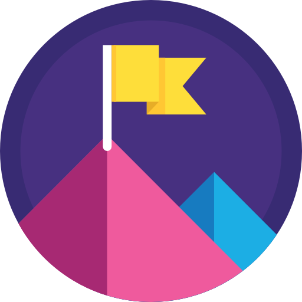

|topmost-logo| TopMost
=================================

.. image:: https://img.shields.io/github/license/bobxwu/topmost
        :target: https://www.apache.org/licenses/LICENSE-2.0/
        :alt: License

.. image:: https://img.shields.io/github/contributors/bobxwu/topmost
        :target: https://github.com/bobxwu/topmost/graphs/contributors/
        :alt: Contributors

.. image:: https://img.shields.io/github/stars/bobxwu/topmost?logo=github
        :target: https://github.com/bobxwu/topmost/stargazers
        :alt: Github Stars

.. image:: https://static.pepy.tech/badge/topmost
        :target: https://pepy.tech/project/topmost
        :alt: Downloads

TopMost provides complete lifecycles of topic modeling, including dataset preprocessing, model training, testing, and evaluations. It covers the most popular topic modeling scenarios, like static, dynamic, hierarchical, and cross-lingual topic modeling.

| This is our demo paper `Towards the TopMost: A Topic Modeling System Toolkit <https://arxiv.org/pdf/2309.06908.pdf>`_.
| This is our survey paper on neural topic models: `A Survey on Neural Topic Models: Methods, Applications, and Challenges <https://assets.researchsquare.com/files/rs-3049182/v1_covered_557a6d7a-c326-45c0-98e2-028fb25af7ba.pdf?c=1686720142>`_.

.. toctree::
   :maxdepth: 1
   :caption: Contents:

   overview
   quick_start
   installation
   tutorials
   misc
